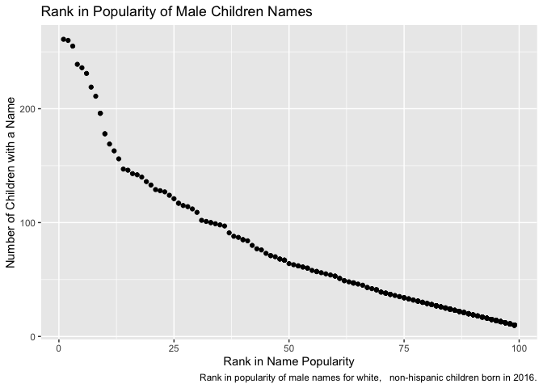

p8105\_hw2\_jl5295
================
Jana Lee
9/29/2019

Load Packages:

``` r
library(tidyverse)
library(readxl)
```

# Problem 1: Mr. Trash Wheel Dataset

Read and clean the Mr. Trash Wheel
sheet:

``` r
trashwheel = read_excel("./Data/Trash-Wheel-Collection-Totals-8-6-19.xlsx", sheet = "Mr. Trash Wheel", range = cell_cols("A:N")) %>%
  janitor :: clean_names() %>% 
  drop_na(dumpster) %>% 
  mutate(
    sports_balls = round (sports_balls),
    sports_balls = as.numeric(sports_balls)
  )
```

Read and clean precipitation data for 2017 and
2018:

``` r
precipitation_2017 = read_excel("./Data/Trash-Wheel-Collection-Totals-8-6-19.xlsx", sheet = "2017 Precipitation", range = cell_rows(2:14)) %>% 
  mutate(year = 2017)

precipitation_2018 = read_excel ("./Data/Trash-Wheel-Collection-Totals-8-6-19.xlsx", sheet = "2018 Precipitation", range = cell_rows(2:14)) %>% 
  mutate(year = 2018)

precipitation_final = bind_rows(precipitation_2017, precipitation_2018) %>% 
  mutate(Month = month.name[Month])
```

**Comment on Problem 1:** The Mr. Trash Wheel dataset has 344
observations and 14 variables. The average weight of trash collected was
3 tons. The average number of homes powered was 44 homes. The weight of
trash is an important measure for understanding how much trash is being
collected in Baltimore, MD. The number of homes powered is important to
evaluate the efficiency of this community project. The median number of
sports balls in a dumpster in 2017 was 8 balls.

The 2017 and 2018 Precipitation datasets each have 12 observations and 3
variables, whereas the combined 2017 and 2018 Precipitation datasets
have 24 observations and 3 variables. The total precipitation in 2018
was 70.33 inches.

# Problem 2: FiveThirtyEight Dataset

Clean and tidy the pols-month
dataset

``` r
pols_month = read_csv(file = "./Data/fivethirtyeight_datasets/pols-month.csv") %>% 
  separate(mon, into = c("year", "month", "day")) %>% 
  mutate(month = month.name[as.numeric(month)],
         president = recode(prez_gop, "0" = "dem", "1" = "gop", "2" = "gop"),
         year = as.numeric(year)) %>% 
  select(-c(prez_dem, prez_gop, day))
```

    ## Parsed with column specification:
    ## cols(
    ##   mon = col_date(format = ""),
    ##   prez_gop = col_double(),
    ##   gov_gop = col_double(),
    ##   sen_gop = col_double(),
    ##   rep_gop = col_double(),
    ##   prez_dem = col_double(),
    ##   gov_dem = col_double(),
    ##   sen_dem = col_double(),
    ##   rep_dem = col_double()
    ## )

Clean and tidy the snp dataset

``` r
snp = read_csv(file ="./Data/fivethirtyeight_datasets/snp.csv") %>% 
  separate(date, into = c("month", "day", "year")) %>% 
  mutate(
    month = month.name[as.numeric(month)],
    year = as.numeric(year)) %>% 
  select(year, month, everything (), -c(day)) %>% 
  arrange(year, month)
```

    ## Parsed with column specification:
    ## cols(
    ##   date = col_character(),
    ##   close = col_double()
    ## )

Clean and tidy the unemployment
dataset

``` r
unemployment = read_csv(file ="./Data/fivethirtyeight_datasets/unemployment.csv") %>% 
  pivot_longer(
   cols = Jan:Dec,
   names_to = "month", 
   values_to = "unemployment") %>% 
  arrange (Year, month) %>% 
  rename(year = Year)
```

    ## Parsed with column specification:
    ## cols(
    ##   Year = col_double(),
    ##   Jan = col_double(),
    ##   Feb = col_double(),
    ##   Mar = col_double(),
    ##   Apr = col_double(),
    ##   May = col_double(),
    ##   Jun = col_double(),
    ##   Jul = col_double(),
    ##   Aug = col_double(),
    ##   Sep = col_double(),
    ##   Oct = col_double(),
    ##   Nov = col_double(),
    ##   Dec = col_double()
    ## )

Join the datasets together: snp to polls

``` r
snp_pols = inner_join(snp, pols_month, by = c("year", "month"))
```

Join unemployment to
result

``` r
unemploy_snp_pols = merge(snp_pols, unemployment, by = c("year", "month")) %>% 
  janitor::clean_names()
```

**Comment on Problem 2:** The pols\_month dataset contained 822
observations and 9 variables. The snp dataset contained 787 observations
and 3 variables. The unemployment dataset contained 816 observations and
3 variables. After joining and merging the datasets, the resulting
dataset has 66 rows, 11 columns, ranges from 1950-2015, and includes the
SNP closing index, presidential party, and unemployment rate, to name a
few variables.

# Problem 3: Popular Baby Names Dataset

Load and tidy the data (babynames)

``` r
library (dplyr)
babynames = read_csv(file = "./Data/Popular_Baby_Names.csv") %>%
  janitor :: clean_names() %>% 
  rename(birth_year = year_of_birth) %>% 
  distinct() %>% 
  mutate(ethnicity = replace (ethnicity, ethnicity == "ASIAN AND PACI", "ASIAN AND PACIFIC ISLANDER")) %>% 
  mutate(ethnicity = replace (ethnicity, ethnicity == "BLACK NON HISP", "BLACK NON HISPANIC")) %>% 
  mutate(ethnicity = replace (ethnicity, ethnicity == "WHITE NON HISP", "WHITE NON HISPANIC")) %>%
  mutate(childs_first_name = toupper(childs_first_name))
```

    ## Parsed with column specification:
    ## cols(
    ##   `Year of Birth` = col_double(),
    ##   Gender = col_character(),
    ##   Ethnicity = col_character(),
    ##   `Child's First Name` = col_character(),
    ##   Count = col_double(),
    ##   Rank = col_double()
    ## )

Produce a well-structured, reader-friendly table for Olivia

``` r
olivia = 
  babynames %>% 
  filter(childs_first_name == "OLIVIA", gender == "FEMALE") %>%
  select(-c("childs_first_name", "count", "gender"))  %>%
  group_by(ethnicity, birth_year) %>% 
  pivot_wider(
    names_from = "birth_year",
    values_from = "rank"
  ) %>% 
  select(ethnicity, `2011`, `2012`, `2013`, `2014`, `2015`, `2016`)
```

Produce a well-structured, reader-friendly table most popular male name

``` r
male_name =
  babynames %>% 
  filter(gender == "MALE", rank == 1) %>% 
  select(-c("count", "gender")) %>% 
  group_by(ethnicity, birth_year) %>% 
  summarize(childs_first_name) %>% 
  pivot_wider(
    names_from = "birth_year",
    values_from = "childs_first_name"
  ) %>% 
  knitr::kable()
male_name
```

| ethnicity                  | 2011    | 2012   | 2013   | 2014   | 2015   | 2016   |
| :------------------------- | :------ | :----- | :----- | :----- | :----- | :----- |
| ASIAN AND PACIFIC ISLANDER | ETHAN   | RYAN   | JAYDEN | JAYDEN | JAYDEN | ETHAN  |
| BLACK NON HISPANIC         | JAYDEN  | JAYDEN | ETHAN  | ETHAN  | NOAH   | NOAH   |
| HISPANIC                   | JAYDEN  | JAYDEN | JAYDEN | LIAM   | LIAM   | LIAM   |
| WHITE NON HISPANIC         | MICHAEL | JOSEPH | DAVID  | JOSEPH | DAVID  | JOSEPH |

Produce a Scatterplot for Rank in Popularity and Number of Children with
a Name

``` r
male_white_2016 =
  babynames %>%
  filter(
    gender == "MALE", 
    ethnicity == "WHITE NON HISPANIC",
    birth_year == 2016)
  
male_white_2016_plot =
  male_white_2016 %>% 
  ggplot(aes(x = rank, y = count)) +
  geom_point() +
  labs(
    x = "Rank in Name Popularity",
    y = "Number of Children with a Name",
    title = "Rank in Popularity of Male Children Names",
    caption = "Rank in popularity of male names for white,   non-hispanic children born in 2016.")

male_white_2016_plot
```

<!-- -->
